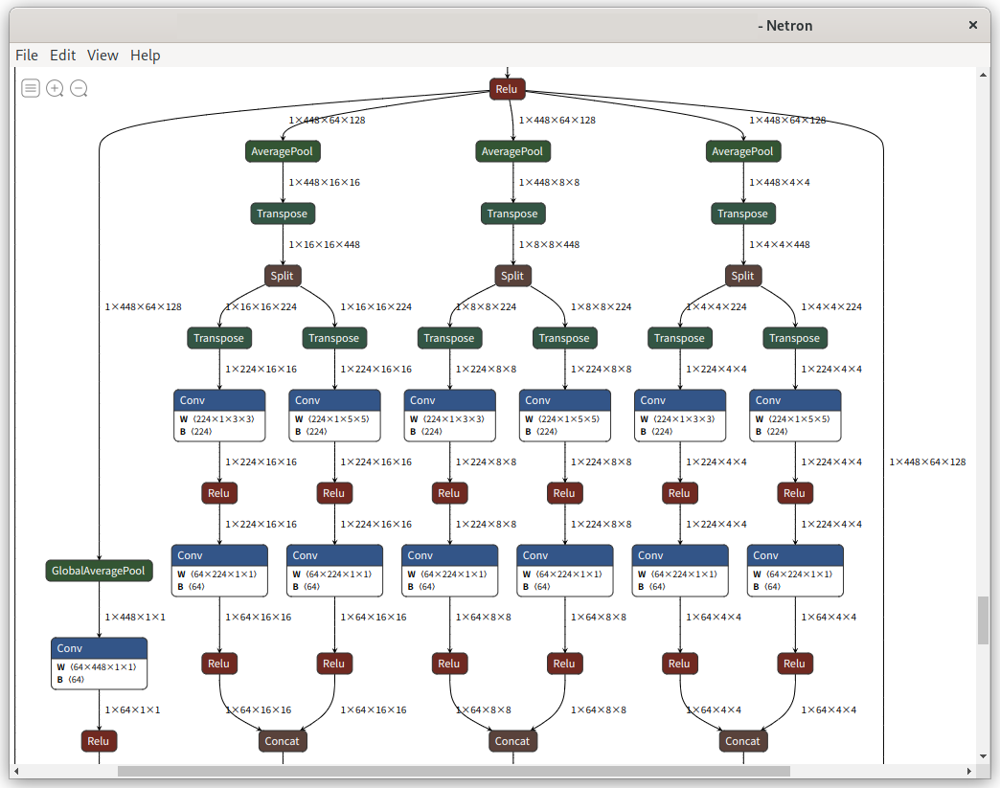
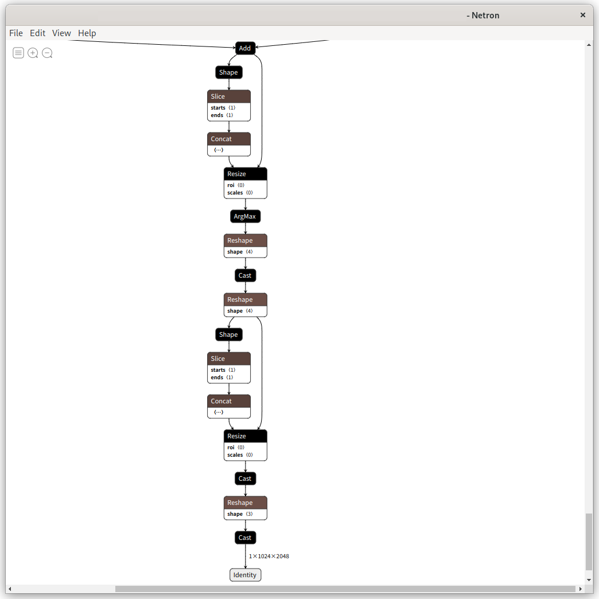

# MOSAIC with TensorRT on Jetson Nano

## Original model

MOSAIC: Mobile Segmentation via decoding Aggregated Information and encoded Context
- [TensorFlow Official Models](https://github.com/tensorflow/models/tree/master/official/projects/mosaic)


## Discription
Convert checkpoints to ONNX model and add fused argmax.

1. Convert checkpoints to TF-Lite model with argmax.
2. Convert TF-Lite model to ONNX model.
3. Convert ONNX model to TF-Lite model using [onnx2tf](https://github.com/PINTO0309/onnx2tf) and replace argmax with [fused argmax](https://github.com/tensorflow/models/tree/master/official/projects/edgetpu/vision#argmax-fusion-to-improve-segmentation-model-latency).
4. Convert TF-Lite model to ONNX model and run Jetson Nano.

## How to


### Host PC
Downlaod checkpoints and convert checkpoints to TF-Lite model.
```
$ git clone https://github.com/PINTO0309/PINTO_model_zoo.git
$ cd PINTO_model_zoo/330_MOSAIC/
$ sudo podman run -it --rm -v `pwd`:/workdir tensorflow/tensorflow:2.10.0-gpu

# apt update && apt install git wget
# cd /workdir
# git clone https://github.com/NobuoTsukamoto/models.git
# cd models
# export PYTHONPATH=$PYTHONPATH:`pwd`
# /usr/bin/python3 -m pip install --upgrade pip
# pip3 install -r official/requirements.txt
# cd official/projects/mosaic/
# wget https://storage.googleapis.com/tf_model_garden/vision/mosaic/MobileNetMultiAVGSeg-r1024-ebf64-gp.tar.gz
# tar xf MobileNetMultiAVGSeg-r1024-ebf64-gp.tar.gz
# python3 serving/export_tflite.py \
    --model_name=mosaic_mnv35_cityscapes \
    --ckpt_path=./gcs_ckpt/best_ckpt-857 \
    --output_dir=/tmp \
    --image_height=1024 \
    --image_width=2048 \
    --finalize_method=resize1024_2048,argmax
# cp /tmp/mosaic_mnv35_cityscapes.tflite /workdir/mosaic_mnv35_cityscapes_argmax.tflite
```

Convert ONNX model.
```
# pip3 install tf2onnx
# cd /workdir
# python3 -m tf2onnx.convert \
    --opset 13 \
    --tflite ./mosaic_mnv35_cityscapes_argmax.tflite \
    --output ./mosaic_mnv35_cityscapes_argmax.onnx \
    --inputs-as-nchw serving_default_input_2:0 \
    --dequantize
```

Convert ONNX model to TF-Lite model and replace argmax with fused argmax.  
The converted onnx model contains `Transpose ope`. You need to exclude `Transpose ope` when converting to TF-Lite model with onnx2tf. Specify the `Transpose ope` to exclude with the `param_replacement_file` option.  


Check the [param_replacement.json](param_replacement.json) file for details.


Note:  
Jetson Nano cannot convert the model due to lack of memory unless `fused_argmax_scale_ratio` is set to `0.25`. It affects quality.
```
# pip3 install onnx \
    && pip3 install nvidia-pyindex \
    && pip3 install onnx-graphsurgeon \
    && pip3 install onnxsim \
    && pip3 install simple_onnx_processing_tools \
    && pip3 install onnx2tf
# onnx2tf \
    -i ./mosaic_mnv35_cityscapes_argmax.onnx \
    -o saved_model \
    --param_replacement_file ./param_replacement.json \
    --replace_argmax_to_fused_argmax_and_indicies_is_int64 \
    --fused_argmax_scale_ratio 0.25
# python3 -m tf2onnx.convert \
    --opset 13 --tflite ./saved_model/model_float32.tflite \
    --output /workdir/mosaic_mnv35_cityscapes_fused_argmax.onnx \
    --inputs-as-nchw inputs_0 \
    --dequantize
``` 

Repace argmax to fused argmax. 



### Exec trtexec on Jetson Nano

Copy `mosaic_mnv35_cityscapes_fused_argmax.onnx` to Jetson Nano.  
Check `trtexec`.
```
$ /usr/src/tensorrt/bin/trtexec \
    --onnx=mosaic_mnv35_cityscapes_argmax.onnx \
    --workspace=512 \
    --verbose=true \
    --fp16

    ...
[11/10/2022-22:09:08] [I] === Performance summary ===
[11/10/2022-22:09:08] [I] Throughput: 1.51249 qps
[11/10/2022-22:09:08] [I] Latency: min = 659.427 ms, max = 664.576 ms, mean = 661.149 ms, median = 660.98 ms, percentile(99%) = 664.576 ms
[11/10/2022-22:09:08] [I] End-to-End Host Latency: min = 659.438 ms, max = 664.586 ms, mean = 661.159 ms, median = 660.989 ms, percentile(99%) = 664.586 ms
[11/10/2022-22:09:08] [I] Enqueue Time: min = 5.93988 ms, max = 6.66797 ms, mean = 6.40006 ms, median = 6.43967 ms, percentile(99%) = 6.66797 ms
[11/10/2022-22:09:08] [I] H2D Latency: min = 2.50977 ms, max = 2.58398 ms, mean = 2.56918 ms, median = 2.57477 ms, percentile(99%) = 2.58398 ms
[11/10/2022-22:09:08] [I] GPU Compute Time: min = 656.029 ms, max = 661.178 ms, mean = 657.757 ms, median = 657.614 ms, percentile(99%) = 661.178 ms
[11/10/2022-22:09:08] [I] D2H Latency: min = 0.815918 ms, max = 0.824219 ms, mean = 0.822473 ms, median = 0.822998 ms, percentile(99%) = 0.824219 ms
[11/10/2022-22:09:08] [I] Total Host Walltime: 6.6116 s
[11/10/2022-22:09:08] [I] Total GPU Compute Time: 6.57757 s
[11/10/2022-22:09:08] [I] Explanations of the performance metrics are printed in the verbose logs.
...
```

## Demo project
- [TensorRT MOSAIC with Python](https://github.com/NobuoTsukamoto/tensorrt-examples/tree/main/python/mosaic)
- [TF-Lite MOSAIC with Python](https://github.com/NobuoTsukamoto/tflite-cv-example/tree/master/mosaic)

## Reference
- https://github.com/tensorflow/models/tree/master/official/projects/mosaic
- https://github.com/tensorflow/models/tree/master/official/projects/edgetpu/vision#argmax-fusion-to-improve-segmentation-model-latency
- https://github.com/PINTO0309/onnx2tf
- https://github.com/NobuoTsukamoto/models/tree/master/official/projects/mosaic/serving