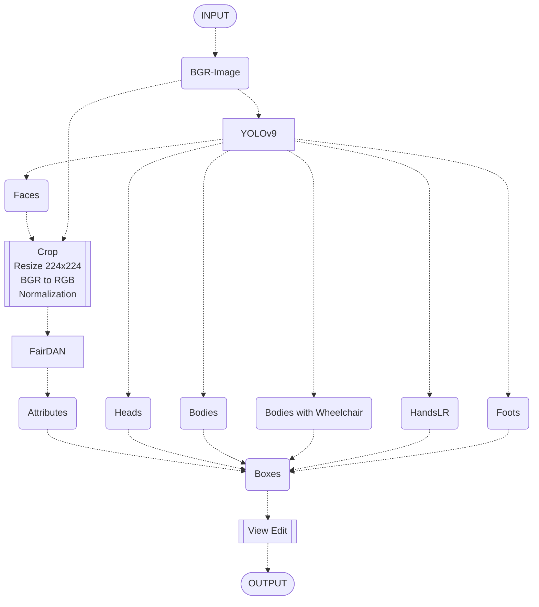

## Note

```
usage:
  demo_fairdan.py \
  [-h] \
  [-dm DETECTION_MODEL] \
  [-am ATTRIBUTES_MODEL] \
  (-v VIDEO | -i IMAGES_DIR) \
  [-ep {cpu,cuda,tensorrt}] \
  [-it {fp16,int8}] \
  [-dvw] \
  [-dwk] \
  [-dlr]

options:
  -h, --help
    show this help message and exit
  -dm DETECTION_MODEL, --detection_model DETECTION_MODEL
    ONNX/TFLite file path for YOLOv9.
  -am ATTRIBUTES_MODEL, --attributes_model ATTRIBUTES_MODEL
    ONNX/TFLite file path for FairDAN.
  -v VIDEO, --video VIDEO
    Video file path or camera index.
  -i IMAGES_DIR, --images_dir IMAGES_DIR
    jpg, png images folder path.
  -ep {cpu,cuda,tensorrt}, --execution_provider {cpu,cuda,tensorrt}
    Execution provider for ONNXRuntime.
  -it {fp16,int8}, --inference_type {fp16,int8}
    Inference type. Default: fp16
  -dvw, --disable_video_writer
    Disable video writer. Eliminates the file I/O load associated with automatic recording to MP4.
    Devices that use a MicroSD card or similar for main storage can speed up overall processing.
  -dwk, --disable_waitKey
    Disable cv2.waitKey(). When you want to process a batch of still images,
    disable key-input wait and process them continuously.
  -dlr, --disable_left_and_right_hand_discrimination_mode
    Disable left and right hand discrimination mode.
```

https://github.com/PINTO0309/PINTO_model_zoo/assets/33194443/925a8ba6-9a2f-44c5-9378-dbd84458f8ce


- FairDAN AffectNet8 labels

  |Attributes|Values|
  |:-|:-|
  |race|`Male`, `Female`|
  |gender|`White`, `Black`, `Latino Hispanic`, `East Asian`, `Southeast Asian`, `Indian`, `Middle Eastern`|
  |age|`0-2`, `3-9`, `10-19`, `20-29`, `30-39`, `40-49`, `50-59`, `60-69`, `70+`|
  |emotion|`Neutral`, `Happy`, `Sad`, `Surprise`, `Fear`, `Disgust`, `Anger`, `Contempt`|


