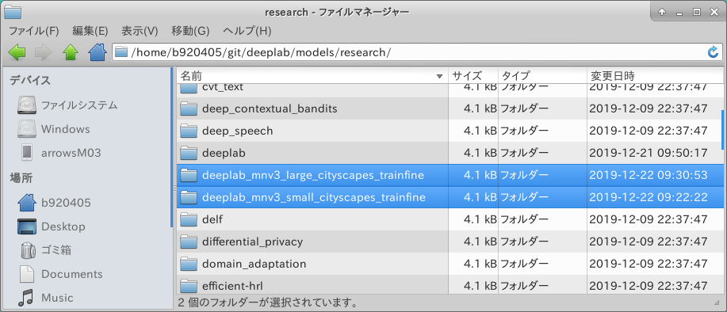
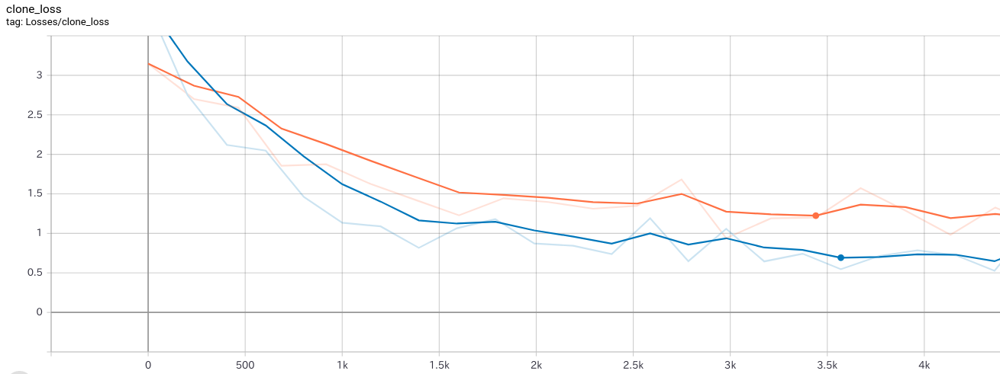

# PINTO_model_zoo
A repository that shares tuning results of trained models generated by Tensorflow. Post-training quantization (Weight Quantization, Integer Quantization, Full Integer Quantization), Quantization-aware training.  

## 1. Environment

- Ubuntu 18.04 x86_64
- Tensorflow-GPU v1.15.0
- Python 3.6.8
- PascalVOC Dataset
- Cityscapes Dataset
- Google Colaboratory

## 2. Procedure
### 2-1. MobileNetV3+DeeplabV3+PascalVOC
#### 2-1-1. Preparation
```bash
$ cd ~
$ mkdir deeplab;cd deeplab
$ git clone --depth 1 https://github.com/tensorflow/models.git
$ cd models/research/deeplab/datasets
$ mkdir pascal_voc_seg

$ curl -sc /tmp/cookie \
  "https://drive.google.com/uc?export=download&id=1rATNHizJdVHnaJtt-hW9MOgjxoaajzdh" > /dev/null
$ CODE="$(awk '/_warning_/ {print $NF}' /tmp/cookie)"
$ curl -Lb /tmp/cookie \
  "https://drive.google.com/uc?export=download&confirm=${CODE}&id=1rATNHizJdVHnaJtt-hW9MOgjxoaajzdh" \
  -o pascal_voc_seg/VOCtrainval_11-May-2012.tar

$ sed -i -e "s/python .\/remove_gt_colormap.py/python3 .\/remove_gt_colormap.py/g" \
      -i -e "s/python .\/build_voc2012_data.py/python3 .\/build_voc2012_data.py/g" \
      download_and_convert_voc2012.sh

$ sh download_and_convert_voc2012.sh

$ cd ../..
$ mkdir -p deeplab/datasets/pascal_voc_seg/exp/train_on_train_set/train
$ mkdir -p deeplab/datasets/pascal_voc_seg/exp/train_on_train_set/eval
$ mkdir -p deeplab/datasets/pascal_voc_seg/exp/train_on_train_set/vis

$ export PATH_TO_TRAIN_DIR=${HOME}/deeplab/models/research/deeplab/datasets/pascal_voc_seg/exp/train_on_train_set/train
$ export PATH_TO_DATASET=${HOME}/deeplab/models/research/deeplab/datasets/pascal_voc_seg/tfrecord
$ export PYTHONPATH=${HOME}/deeplab/models/research:${HOME}/deeplab/models/research/deeplab:${HOME}/deeplab/models/research/slim:${PYTHONPATH}
```

```python
# See feature_extractor.network_map for supported model variants.
# models/research/deeplab/core/feature_extractor.py

networks_map = {
    'mobilenet_v2': _mobilenet_v2,
    'mobilenet_v3_large_seg': mobilenet_v3_large_seg,
    'mobilenet_v3_small_seg': mobilenet_v3_small_seg,
    'resnet_v1_18': resnet_v1_beta.resnet_v1_18,
    'resnet_v1_18_beta': resnet_v1_beta.resnet_v1_18_beta,
    'resnet_v1_50': resnet_v1_beta.resnet_v1_50,
    'resnet_v1_50_beta': resnet_v1_beta.resnet_v1_50_beta,
    'resnet_v1_101': resnet_v1_beta.resnet_v1_101,
    'resnet_v1_101_beta': resnet_v1_beta.resnet_v1_101_beta,
    'xception_41': xception.xception_41,
    'xception_65': xception.xception_65,
    'xception_71': xception.xception_71,
    'nas_pnasnet': nas_network.pnasnet,
    'nas_hnasnet': nas_network.hnasnet,
}
```
#### 2-1-2. "mobilenet_v3_small_seg" Float32 regular training
```bash
$ python3 deeplab/train.py \
    --logtostderr \
    --training_number_of_steps=500000 \
    --train_split="train" \
    --model_variant="mobilenet_v3_small_seg" \
    --decoder_output_stride=16 \
    --train_crop_size="513,513" \
    --train_batch_size=8 \
    --dataset="pascal_voc_seg" \
    --save_interval_secs=300 \
    --save_summaries_secs=300 \
    --save_summaries_images=True \
    --log_steps=100 \
    --train_logdir=${PATH_TO_TRAIN_DIR} \
    --dataset_dir=${PATH_TO_DATASET}
```

#### 2-1-3. "mobilenet_v3_large_seg" Float32 regular training
```bash
$ python3 deeplab/train.py \
    --logtostderr \
    --training_number_of_steps=1000000 \
    --train_split="train" \
    --model_variant="mobilenet_v3_large_seg" \
    --decoder_output_stride=16 \
    --train_crop_size="513,513" \
    --train_batch_size=8 \
    --dataset="pascal_voc_seg" \
    --save_interval_secs=300 \
    --save_summaries_secs=300 \
    --save_summaries_images=True \
    --log_steps=100 \
    --train_logdir=${PATH_TO_TRAIN_DIR} \
    --dataset_dir=${PATH_TO_DATASET}
```

#### 2-1-4. Visualize training status
```bash
$ tensorboard \
  --logdir ${HOME}/deeplab/models/research/deeplab/datasets/pascal_voc_seg/exp/train_on_train_set/train
```
　  
　  
### 2-2. MobileNetV3+DeeplabV3+Cityscaps - Post-training quantization
#### 2-2-1. Preparation
```bash
$ cd ~
$ mkdir -p git/deeplab && cd git/deeplab
$ git clone --depth 1 https://github.com/tensorflow/models.git
$ cd models/research/deeplab/datasets
$ mkdir cityscapes && cd cityscapes

# Clone the script to generate Cityscapes Dataset.
$ git clone --depth 1 https://github.com/mcordts/cityscapesScripts.git
$ mv cityscapesScripts cityscapesScripts_ && \
  mv cityscapesScripts_/cityscapesscripts . && \
  rm -rf cityscapesScripts_

# Download Cityscapes Dataset.
# https://www.cityscapes-dataset.com/
# You will need to sign up and issue a userID and password to download the data set.
$ wget --keep-session-cookies --save-cookies=cookies.txt \
  --post-data 'username=(userid)&password=(password)&submit=Login' \
  https://www.cityscapes-dataset.com/login/
$ wget --load-cookies cookies.txt \
  --content-disposition https://www.cityscapes-dataset.com/file-handling/?packageID=1
$ wget --load-cookies cookies.txt \
  --content-disposition https://www.cityscapes-dataset.com/file-handling/?packageID=3
$ unzip gtFine_trainvaltest.zip && rm gtFine_trainvaltest.zip
$ rm README && rm license.txt
$ unzip leftImg8bit_trainvaltest.zip && rm leftImg8bit_trainvaltest.zip
$ rm README && rm license.txt

# Convert Cityscapes Dataset to TFRecords format.
$ cd ..
$ sed -i -e "s/python/python3/g" convert_cityscapes.sh
$ export PYTHONPATH=${HOME}/git/deeplab/models/research/deeplab/datasets/cityscapes:${PYTHONPATH}
$ sh convert_cityscapes.sh

# Create a checkpoint storage folder for training. If training is not required,
# there is no need to carry out.
$ cd ../..
$ mkdir -p deeplab/datasets/cityscapes/exp/train_on_train_set/train && \
  mkdir -p deeplab/datasets/cityscapes/exp/train_on_train_set/eval && \
  mkdir -p deeplab/datasets/cityscapes/exp/train_on_train_set/vis

# Download the DeepLabV3 trained model of the MobileNetV3 backbone.
$ curl -sc /tmp/cookie \
  "https://drive.google.com/uc?export=download&id=1f5ccaJmJBYwBmHvRQ77yGIUcXnqQIRY_" > /dev/null
$ CODE="$(awk '/_warning_/ {print $NF}' /tmp/cookie)"
$ curl -Lb /tmp/cookie \
  "https://drive.google.com/uc?export=download&confirm=${CODE}&id=1f5ccaJmJBYwBmHvRQ77yGIUcXnqQIRY_" \
  -o deeplab_mnv3_small_cityscapes_trainfine_2019_11_15.tar.gz
$ tar -zxvf deeplab_mnv3_small_cityscapes_trainfine_2019_11_15.tar.gz
$ rm deeplab_mnv3_small_cityscapes_trainfine_2019_11_15.tar.gz

$ curl -sc /tmp/cookie \
  "https://drive.google.com/uc?export=download&id=1QxS3G55rUQvuiBF-hztQv5zCkfPfwlVU" > /dev/null
$ CODE="$(awk '/_warning_/ {print $NF}' /tmp/cookie)"
$ curl -Lb /tmp/cookie \
  "https://drive.google.com/uc?export=download&confirm=${CODE}&id=1QxS3G55rUQvuiBF-hztQv5zCkfPfwlVU" \
  -o deeplab_mnv3_large_cityscapes_trainfine_2019_11_15.tar.gz
$ tar -zxvf deeplab_mnv3_large_cityscapes_trainfine_2019_11_15.tar.gz
$ rm deeplab_mnv3_large_cityscapes_trainfine_2019_11_15.tar.gz

$ export PATH_TO_INITIAL_CHECKPOINT=${HOME}/git/deeplab/models/research/deeplab_mnv3_small_cityscapes_trainfine/model.ckpt
$ export PATH_TO_DATASET=${HOME}/git/deeplab/models/research/deeplab/datasets/cityscapes/tfrecord
$ export PYTHONPATH=${HOME}/git/deeplab/models/research:${HOME}/git/deeplab/models/research/deeplab:${HOME}/git/deeplab/models/research/slim:${PYTHONPATH}

# Fix a bug in the data generator.
$ sed -i -e \
  "s/splits_to_sizes={'train_fine': 2975,/splits_to_sizes={'train': 2975,/g" \
  deeplab/datasets/data_generator.py

# Back up the trained model.
$ cd ${HOME}/git/deeplab/models/research
$ cp deeplab/export_model.py deeplab/export_model.py_org
$ cp deeplab_mnv3_small_cityscapes_trainfine/frozen_inference_graph.pb \
  deeplab_mnv3_small_cityscapes_trainfine/frozen_inference_graph_org.pb
$ cp deeplab_mnv3_large_cityscapes_trainfine/frozen_inference_graph.pb \
  deeplab_mnv3_large_cityscapes_trainfine/frozen_inference_graph_org.pb

# Customize "export_model.py" according to the input resolution. Must be (multiple of 8 + 1).
#   (example.1) 769 = 8 * 96 + 1
#   (example.2) 512 = 8 * 64 + 1
#   (example.3) 320 = 8 * 40 + 1
# And it is necessary to change from tf.uint8 type to tf.float32 type.
$ sed -i -e \
  "s/tf.placeholder(tf.uint8, \[1, None, None, 3\], name=_INPUT_NAME)/tf.placeholder(tf.float32, \[1, 769, 769, 3\], name=_INPUT_NAME)/g" \
  deeplab/export_model.py
```
#### 2-2-2. Parameter sheet
```bash
# crop_size and image_pooling_crop_size are multiples of --decoder_output_stride + 1
# 769 = 8 * 96 + 1
# 512 = 8 * 64 + 1
# 320 = 8 * 40 + 1

# --initialize_last_layer=True initializes the final layer with the weight of  
# tf_initial_checkpoint (inherits the weight)

# Named tuple to describe the dataset properties.
# deeplab/datasets/data_generator.py
DatasetDescriptor = collections.namedtuple(
    'DatasetDescriptor',
    [
        'splits_to_sizes',  # Splits of the dataset into training, val and test.
        'num_classes',  # Number of semantic classes, including the
                        # background class (if exists). For example, there
                        # are 20 foreground classes + 1 background class in
                        # the PASCAL VOC 2012 dataset. Thus, we set
                        # num_classes=21.
        'ignore_label',  # Ignore label value.
    ])

_CITYSCAPES_INFORMATION = DatasetDescriptor(
    splits_to_sizes={'train': 2975,
                     'train_coarse': 22973,
                     'trainval_fine': 3475,
                     'trainval_coarse': 23473,
                     'val_fine': 500,
                     'test_fine': 1525},
    num_classes=19,
    ignore_label=255,
)

_PASCAL_VOC_SEG_INFORMATION = DatasetDescriptor(
    splits_to_sizes={
        'train': 1464,
        'train_aug': 10582,
        'trainval': 2913,
        'val': 1449,
    },
    num_classes=21,
    ignore_label=255,
)

_ADE20K_INFORMATION = DatasetDescriptor(
    splits_to_sizes={
        'train': 20210,  # num of samples in images/training
        'val': 2000,  # num of samples in images/validation
    },
    num_classes=151,
    ignore_label=0,
)

_DATASETS_INFORMATION = {
    'cityscapes': _CITYSCAPES_INFORMATION,
    'pascal_voc_seg': _PASCAL_VOC_SEG_INFORMATION,
    'ade20k': _ADE20K_INFORMATION,
}

# A map from network name to network function. model_variant.
# deeplab/core/feature_extractor.py
networks_map = {
    'mobilenet_v2': _mobilenet_v2,
    'mobilenet_v3_large_seg': mobilenet_v3_large_seg,
    'mobilenet_v3_small_seg': mobilenet_v3_small_seg,
    'resnet_v1_18': resnet_v1_beta.resnet_v1_18,
    'resnet_v1_18_beta': resnet_v1_beta.resnet_v1_18_beta,
    'resnet_v1_50': resnet_v1_beta.resnet_v1_50,
    'resnet_v1_50_beta': resnet_v1_beta.resnet_v1_50_beta,
    'resnet_v1_101': resnet_v1_beta.resnet_v1_101,
    'resnet_v1_101_beta': resnet_v1_beta.resnet_v1_101_beta,
    'xception_41': xception.xception_41,
    'xception_65': xception.xception_65,
    'xception_71': xception.xception_71,
    'nas_pnasnet': nas_network.pnasnet,
    'nas_hnasnet': nas_network.hnasnet,
}
```
#### 2-2-3. "mobilenet_v3_small_seg" Export Model
Generate Freeze Graph (.pb) with INPUT Placeholder changed from checkpoint file (.ckpt).
```bash
$ python3 deeplab/export_model.py \
    --checkpoint_path=./deeplab_mnv3_small_cityscapes_trainfine/model.ckpt \
    --export_path=./deeplab_mnv3_small_cityscapes_trainfine/frozen_inference_graph.pb \
    --num_classes=19 \
    --crop_size=769 \
    --crop_size=769 \
    --model_variant="mobilenet_v3_small_seg" \
    --image_pooling_crop_size="769,769" \
    --image_pooling_stride=4,5 \
    --aspp_convs_filters=128 \
    --aspp_with_concat_projection=0 \
    --aspp_with_squeeze_and_excitation=1 \
    --decoder_use_sum_merge=1 \
    --decoder_filters=19 \
    --decoder_output_is_logits=1 \
    --image_se_uses_qsigmoid=1 \
    --image_pyramid=1 \
    --decoder_output_stride=8
```
#### 2-2-4. "mobilenet_v3_large_seg" Export Model
Generate Freeze Graph (.pb) with INPUT Placeholder changed from checkpoint file (.ckpt).
```bash
$ python3 deeplab/export_model.py \
    --checkpoint_path=./deeplab_mnv3_large_cityscapes_trainfine/model.ckpt \
    --export_path=./deeplab_mnv3_large_cityscapes_trainfine/frozen_inference_graph.pb \
    --num_classes=19 \
    --crop_size=769 \
    --crop_size=769 \
    --model_variant="mobilenet_v3_large_seg" \
    --image_pooling_crop_size="769,769" \
    --image_pooling_stride=4,5 \
    --aspp_convs_filters=128 \
    --aspp_with_concat_projection=0 \
    --aspp_with_squeeze_and_excitation=1 \
    --decoder_use_sum_merge=1 \
    --decoder_filters=19 \
    --decoder_output_is_logits=1 \
    --image_se_uses_qsigmoid=1 \
    --image_pyramid=1 \
    --decoder_output_stride=8
```
If you follow the Google Colaboratory sample procedure, copy the "deeplab_mnv3_small_cityscapes_trainfine" folder and "deeplab_mnv3_large_cityscapes_trainfine" to your Google Drive "My Drive". It is not necessary if all procedures described in Google Colaboratory are performed in a PC environment.
  
  

#### 2-2-5. Google Colaboratory - Post-training quantization - post_training_integer_quant.ipynb
- Weight Quantization
- Integer Quantization
- Full Integer Quantization  

https://colab.research.google.com/drive/1TtCJ-uMNTArpZxrf5DCNbZdn08DsiW8F  
　  
　  
### 2-3. MobileNetV3+DeeplabV3+Cityscaps - Quantization-aware training
#### 2-3-1. "mobilenet_v3_small_seg" Quantization-aware training
```bash
$ cd ${HOME}/git/deeplab/models/research
$ export PATH_TO_TRAINED_FLOAT_MODEL=${HOME}/git/deeplab/models/research/deeplab_mnv3_small_cityscapes_trainfine/model.ckpt
$ export PATH_TO_TRAIN_DIR=${HOME}/git/deeplab/models/research/deeplab/datasets/cityscapes/exp/train_on_train_set/train
$ export PATH_TO_DATASET=${HOME}/git/deeplab/models/research/deeplab/datasets/cityscapes/tfrecord

# deeplab_mnv3_small_cityscapes_trainfine
$ python3 deeplab/train.py \
    --logtostderr \
    --training_number_of_steps=5000 \
    --train_split="train" \
    --model_variant="mobilenet_v3_small_seg" \
    --train_crop_size="769,769" \
    --train_batch_size=8 \
    --dataset="cityscapes" \
    --initialize_last_layer=False \
    --base_learning_rate=3e-5 \
    --quantize_delay_step=0 \
    --image_pooling_crop_size="769,769" \
    --image_pooling_stride=4,5 \
    --aspp_convs_filters=128 \
    --aspp_with_concat_projection=0 \
    --aspp_with_squeeze_and_excitation=1 \
    --decoder_use_sum_merge=1 \
    --decoder_filters=19 \
    --decoder_output_is_logits=1 \
    --image_se_uses_qsigmoid=1 \
    --image_pyramid=1 \
    --decoder_output_stride=8 \
    --save_interval_secs=300 \
    --save_summaries_secs=300 \
    --save_summaries_images=True \
    --log_steps=100 \
    --tf_initial_checkpoint=${PATH_TO_TRAINED_FLOAT_MODEL} \
    --train_logdir=${PATH_TO_TRAIN_DIR} \
    --dataset_dir=${PATH_TO_DATASET}
```
#### 2-3-2. "mobilenet_v3_large_seg" Quantization-aware training
```bash
$ cd ${HOME}/git/deeplab/models/research
$ export PATH_TO_TRAINED_FLOAT_MODEL=${HOME}/git/deeplab/models/research/deeplab_mnv3_large_cityscapes_trainfine/model.ckpt
$ export PATH_TO_TRAIN_DIR=${HOME}/git/deeplab/models/research/deeplab/datasets/cityscapes/exp/train_on_train_set/train
$ export PATH_TO_DATASET=${HOME}/git/deeplab/models/research/deeplab/datasets/cityscapes/tfrecord

# deeplab_mnv3_large_cityscapes_trainfine
$ python3 deeplab/train.py \
    --logtostderr \
    --training_number_of_steps=4350 \
    --train_split="train" \
    --model_variant="mobilenet_v3_large_seg" \
    --train_crop_size="769,769" \
    --train_batch_size=8 \
    --dataset="cityscapes" \
    --initialize_last_layer=False \
    --base_learning_rate=3e-5 \
    --quantize_delay_step=0 \
    --image_pooling_crop_size="769,769" \
    --image_pooling_stride=4,5 \
    --aspp_convs_filters=128 \
    --aspp_with_concat_projection=0 \
    --aspp_with_squeeze_and_excitation=1 \
    --decoder_use_sum_merge=1 \
    --decoder_filters=19 \
    --decoder_output_is_logits=1 \
    --image_se_uses_qsigmoid=1 \
    --image_pyramid=1 \
    --decoder_output_stride=8 \
    --save_interval_secs=300 \
    --save_summaries_secs=300 \
    --save_summaries_images=True \
    --log_steps=100 \
    --tf_initial_checkpoint=${PATH_TO_TRAINED_FLOAT_MODEL} \
    --train_logdir=${PATH_TO_TRAIN_DIR} \
    --dataset_dir=${PATH_TO_DATASET}
```
The orange line is "deeplab_mnv3_small_cityscapes_trainfine" loss.  
The blue line is "deeplab_mnv3_large_cityscapes_trainfine" loss.  
  

## 3. TFLite Model Benchmark
```bash
$ sudo apt-get install python-future
$ git clone -b v1.15.0 --depth 1 https://github.com/tensorflow/tensorflow.git
$ cd tensorflow

$ bazel run -c opt tensorflow/lite/tools/benchmark:benchmark_model -- \
  --graph=${HOME}/Downloads/deeplab_mnv3_small_weight_quant_769.tflite \
  --num_threads=4 \
  --warmup_runs=1 \
  --enable_op_profiling=true
```

<details><summary>deeplab_mnv3_small_weight_quant_769.tflite Benchmark</summary><div>

```console
Min num runs: [50]
Min runs duration (seconds): [1]
Max runs duration (seconds): [150]
Inter-run delay (seconds): [-1]
Num threads: [4]
Benchmark name: []
Output prefix: []
Min warmup runs: [1]
Min warmup runs duration (seconds): [0.5]
Graph: [${HOME}/Downloads/deeplab_mnv3_small_weight_quant_769.tflite]
Input layers: []
Input shapes: []
Input value ranges: []
Use gpu : [0]
Allow fp16 : [0]
Require full delegation : [0]
Enable op profiling: [1]
Max profiling buffer entries: [1024]
Loaded model ${HOME}/Downloads/deeplab_mnv3_small_weight_quant_769.tflite
resolved reporter
Initialized session in 0.656ms
[Init Phase] - Memory usage: max resident set size = 0 MB, total malloc-ed size = 0.210434 MB
Running benchmark for at least 1 iterations and at least 0.5 seconds but terminate if exceeding 150 seconds.
count=1 curr=2062569

Running benchmark for at least 50 iterations and at least 1 seconds but terminate if exceeding 150 seconds.
count=50 first=1993869 curr=1869091 min=1847392 max=2089433 avg=1.92577e+06 std=53490

[Overall] - Memory usage: max resident set size = 59.9375 MB, total malloc-ed size = 0.305466 MB
Average inference timings in us: Warmup: 2.06257e+06, Init: 656, no stats: 1.92577e+06
============================== Run Order ==============================
	             [node type]	          [start]	  [first]	 [avg ms]	     [%]	  [cdf%]	  [mem KB]	[times called]	[Name]
	        Misc Runtime Ops	            0.000	    0.224	    0.224	  0.000%	  0.000%	    33.552	        0	AllocateTensors/0
	                 RESHAPE	            0.000	    0.659	    0.682	  0.035%	  0.036%	     0.000	        0	[Squeeze]:0
	                     SUB	            0.682	    3.299	    3.187	  0.165%	  0.201%	     0.000	        0	[pad_to_bounding_box/sub]:1
	                 RESHAPE	            3.869	    0.549	    0.549	  0.029%	  0.230%	     0.000	        0	[pad_to_bounding_box/ExpandDims]:2
	                     PAD	            4.418	    0.691	    0.687	  0.036%	  0.266%	     0.000	        0	[pad_to_bounding_box/Pad]:3
	                 RESHAPE	            5.105	    0.399	    0.405	  0.021%	  0.287%	     0.000	        0	[pad_to_bounding_box/Squeeze]:4
	                     ADD	            5.510	    2.781	    2.733	  0.142%	  0.428%	     0.000	        0	[pad_to_bounding_box/add]:5
	                     MUL	            8.243	    0.636	    0.644	  0.033%	  0.462%	     0.000	        0	[ExpandDims]:6
	                     SUB	            8.887	    3.393	    3.190	  0.166%	  0.628%	     0.000	        0	[mul]:7
	                 RESHAPE	           12.077	    0.473	    0.459	  0.024%	  0.651%	     0.000	        0	[sub_2]:8
	                 CONV_2D	           12.536	    7.896	    9.327	  0.484%	  1.136%	     0.000	        0	[MobilenetV3/Conv/BatchNorm/FusedBatchNormV3]:9
	                     ADD	           21.864	    0.947	    0.989	  0.051%	  1.187%	     0.000	        0	[MobilenetV3/Conv/hard_swish/Relu6]:10
	                     MUL	           22.853	    1.348	    1.392	  0.072%	  1.259%	     0.000	        0	[MobilenetV3/Conv/hard_swish/mul]:11
	       DEPTHWISE_CONV_2D	           24.246	    5.956	    6.359	  0.330%	  1.590%	     0.000	        0	[MobilenetV3/expanded_conv/depthwise/Relu]:12
	         AVERAGE_POOL_2D	           30.605	    0.627	    0.618	  0.032%	  1.622%	     0.000	        0	[MobilenetV3/expanded_conv/squeeze_excite/AvgPool]:13
	                 CONV_2D	           31.223	    0.003	    0.003	  0.000%	  1.622%	     0.000	        0	[MobilenetV3/expanded_conv/squeeze_excite/Conv/Relu]:14
	                 CONV_2D	           31.226	    0.001	    0.001	  0.000%	  1.622%	     0.000	        0	[MobilenetV3/expanded_conv/squeeze_excite/Conv_1/Relu6]:15
	                     MUL	           31.226	    0.001	    0.001	  0.000%	  1.622%	     0.000	        0	[MobilenetV3/expanded_conv/squeeze_excite/Conv_1/mul]:16
	                     MUL	           31.228	    0.343	    0.330	  0.017%	  1.639%	     0.000	        0	[MobilenetV3/expanded_conv/squeeze_excite/mul]:17
	                 CONV_2D	           31.558	    0.664	    0.722	  0.037%	  1.677%	     0.000	        0	[MobilenetV3/expanded_conv/project/BatchNorm/FusedBatchNormV3]:18
	                 CONV_2D	           32.280	   35.492	   34.441	  1.788%	  3.465%	     0.000	        0	[MobilenetV3/expanded_conv_1/expand/Relu]:19
	       DEPTHWISE_CONV_2D	           66.721	    7.343	    7.047	  0.366%	  3.831%	     0.000	        0	[MobilenetV3/expanded_conv_1/depthwise/Relu]:20
	                 CONV_2D	           73.768	   13.958	   13.590	  0.706%	  4.537%	     0.000	        0	[MobilenetV3/expanded_conv_1/project/BatchNorm/FusedBatchNormV3]:21
	                 CONV_2D	           87.359	   15.244	   14.110	  0.733%	  5.269%	     0.000	        0	[MobilenetV3/expanded_conv_2/expand/Relu]:22
	       DEPTHWISE_CONV_2D	          101.469	    9.034	    8.566	  0.445%	  5.714%	     0.000	        0	[MobilenetV3/expanded_conv_2/depthwise/Relu]:23
	                 CONV_2D	          110.034	   18.043	   17.645	  0.916%	  6.630%	     0.000	        0	[MobilenetV3/expanded_conv_2/project/BatchNorm/FusedBatchNormV3]:24
	                     ADD	          127.679	    0.121	    0.093	  0.005%	  6.635%	     0.000	        0	[MobilenetV3/expanded_conv_2/add]:25
	                 CONV_2D	          127.772	   15.512	   15.435	  0.801%	  7.437%	     0.000	        0	[MobilenetV3/expanded_conv_3/expand/BatchNorm/FusedBatchNormV3]:26
	                     ADD	          143.207	    0.257	    0.284	  0.015%	  7.451%	     0.000	        0	[MobilenetV3/expanded_conv_3/expand/hard_swish/Relu6]:27
	                     MUL	          143.491	    0.402	    0.436	  0.023%	  7.474%	     0.000	        0	[MobilenetV3/expanded_conv_3/expand/hard_swish/mul]:28
	              DEQUANTIZE	          143.928	    0.000	    0.001	  0.000%	  7.474%	     0.000	        0	[MobilenetV3/expanded_conv_3/depthwise/depthwise_weights_dequantize]:29
	       DEPTHWISE_CONV_2D	          143.928	   26.646	   25.868	  1.343%	  8.817%	     0.000	        0	[MobilenetV3/expanded_conv_3/depthwise/BatchNorm/FusedBatchNormV3]:30
	              HARD_SWISH	          169.796	    1.715	    1.629	  0.085%	  8.902%	     0.000	        0	[MobilenetV3/expanded_conv_3/depthwise/hard_swish/mul_1]:31
	         AVERAGE_POOL_2D	          171.425	    0.309	    0.309	  0.016%	  8.918%	     0.000	        0	[MobilenetV3/expanded_conv_3/squeeze_excite/AvgPool]:32
	                 CONV_2D	          171.735	    0.004	    0.005	  0.000%	  8.918%	     0.000	        0	[MobilenetV3/expanded_conv_3/squeeze_excite/Conv/Relu]:33
	                 CONV_2D	          171.740	    0.003	    0.002	  0.000%	  8.918%	     0.000	        0	[MobilenetV3/expanded_conv_3/squeeze_excite/Conv_1/Relu6]:34
	                     MUL	          171.742	    0.001	    0.002	  0.000%	  8.918%	     0.000	        0	[MobilenetV3/expanded_conv_3/squeeze_excite/Conv_1/mul]:35
	                     MUL	          171.744	    0.311	    0.337	  0.017%	  8.936%	     0.000	        0	[MobilenetV3/expanded_conv_3/squeeze_excite/mul]:36
	                 CONV_2D	          172.080	   29.645	   28.385	  1.474%	 10.410%	     0.000	        0	[MobilenetV3/expanded_conv_3/project/BatchNorm/FusedBatchNormV3]:37
	                 CONV_2D	          200.466	   69.432	   66.349	  3.445%	 13.855%	     0.000	        0	[MobilenetV3/expanded_conv_4/expand/BatchNorm/FusedBatchNormV3]:38
	              HARD_SWISH	          266.815	    3.743	    3.711	  0.193%	 14.048%	     0.000	        0	[MobilenetV3/expanded_conv_4/expand/hard_swish/mul_1]:39
	       SPACE_TO_BATCH_ND	          270.526	    1.540	    1.644	  0.085%	 14.133%	     0.000	        0	[MobilenetV3/expanded_conv_4/depthwise/depthwise/SpaceToBatchND]:40
	              DEQUANTIZE	          272.171	    0.000	    0.001	  0.000%	 14.133%	     0.000	        0	[MobilenetV3/expanded_conv_4/depthwise/depthwise_weights_dequantize]:41
	       DEPTHWISE_CONV_2D	          272.172	   69.244	   66.011	  3.428%	 17.561%	     0.000	        0	[MobilenetV3/expanded_conv_4/depthwise/depthwise]:42
	       BATCH_TO_SPACE_ND	          338.183	    1.284	    1.315	  0.068%	 17.629%	     0.000	        0	[MobilenetV3/expanded_conv_4/depthwise/depthwise/BatchToSpaceND]:43
	                     MUL	          339.498	    0.933	    0.971	  0.050%	 17.680%	     0.000	        0	[MobilenetV3/expanded_conv_4/depthwise/BatchNorm/FusedBatchNormV3_mul_0]:44
	                     ADD	          340.469	    0.922	    0.950	  0.049%	 17.729%	     0.000	        0	[MobilenetV3/expanded_conv_4/depthwise/BatchNorm/FusedBatchNormV3]:45
	              HARD_SWISH	          341.420	    4.177	    3.981	  0.207%	 17.936%	     0.000	        0	[MobilenetV3/expanded_conv_4/depthwise/hard_swish/mul_1]:46
	         AVERAGE_POOL_2D	          345.401	    0.642	    0.655	  0.034%	 17.970%	     0.000	        0	[MobilenetV3/expanded_conv_4/squeeze_excite/AvgPool]:47
	                 CONV_2D	          346.057	    0.013	    0.013	  0.001%	 17.971%	     0.000	        0	[MobilenetV3/expanded_conv_4/squeeze_excite/Conv/Relu]:48
	                 CONV_2D	          346.070	    0.010	    0.010	  0.001%	 17.971%	     0.000	        0	[MobilenetV3/expanded_conv_4/squeeze_excite/Conv_1/Relu6]:49
	                     MUL	          346.080	    0.001	    0.001	  0.000%	 17.971%	     0.000	        0	[MobilenetV3/expanded_conv_4/squeeze_excite/Conv_1/mul]:50
	                     MUL	          346.082	    0.898	    0.957	  0.050%	 18.021%	     0.000	        0	[MobilenetV3/expanded_conv_4/squeeze_excite/mul]:51
	                 CONV_2D	          347.038	   68.324	   64.801	  3.365%	 21.386%	     0.000	        0	[MobilenetV3/expanded_conv_4/project/BatchNorm/FusedBatchNormV3]:52
	                     ADD	          411.839	    0.164	    0.182	  0.009%	 21.395%	     0.000	        0	[MobilenetV3/expanded_conv_4/add]:53
	                 CONV_2D	          412.021	   69.802	   66.144	  3.435%	 24.830%	     0.000	        0	[MobilenetV3/expanded_conv_5/expand/BatchNorm/FusedBatchNormV3]:54
	              HARD_SWISH	          478.165	    3.715	    3.611	  0.188%	 25.018%	     0.000	        0	[MobilenetV3/expanded_conv_5/expand/hard_swish/mul_1]:55
	       SPACE_TO_BATCH_ND	          481.777	    1.560	    1.677	  0.087%	 25.105%	     0.000	        0	[MobilenetV3/expanded_conv_5/depthwise/depthwise/SpaceToBatchND]:56
	              DEQUANTIZE	          483.454	    0.000	    0.001	  0.000%	 25.105%	     0.000	        0	[MobilenetV3/expanded_conv_5/depthwise/depthwise_weights_dequantize]:57
	       DEPTHWISE_CONV_2D	          483.455	   68.911	   65.979	  3.426%	 28.531%	     0.000	        0	[MobilenetV3/expanded_conv_5/depthwise/depthwise]:58
	       BATCH_TO_SPACE_ND	          549.434	    1.297	    1.299	  0.067%	 28.598%	     0.000	        0	[MobilenetV3/expanded_conv_5/depthwise/depthwise/BatchToSpaceND]:59
	                     MUL	          550.734	    1.036	    1.012	  0.053%	 28.651%	     0.000	        0	[MobilenetV3/expanded_conv_5/depthwise/BatchNorm/FusedBatchNormV3_mul_0]:60
	                     ADD	          551.746	    0.862	    0.917	  0.048%	 28.698%	     0.000	        0	[MobilenetV3/expanded_conv_5/depthwise/BatchNorm/FusedBatchNormV3]:61
	              HARD_SWISH	          552.663	    3.960	    3.840	  0.199%	 28.898%	     0.000	        0	[MobilenetV3/expanded_conv_5/depthwise/hard_swish/mul_1]:62
	         AVERAGE_POOL_2D	          556.503	    0.643	    0.641	  0.033%	 28.931%	     0.000	        0	[MobilenetV3/expanded_conv_5/squeeze_excite/AvgPool]:63
	                 CONV_2D	          557.144	    0.013	    0.013	  0.001%	 28.932%	     0.000	        0	[MobilenetV3/expanded_conv_5/squeeze_excite/Conv/Relu]:64
	                 CONV_2D	          557.157	    0.011	    0.010	  0.001%	 28.932%	     0.000	        0	[MobilenetV3/expanded_conv_5/squeeze_excite/Conv_1/Relu6]:65
	                     MUL	          557.167	    0.001	    0.001	  0.000%	 28.932%	     0.000	        0	[MobilenetV3/expanded_conv_5/squeeze_excite/Conv_1/mul]:66
	                     MUL	          557.168	    0.873	    0.944	  0.049%	 28.981%	     0.000	        0	[MobilenetV3/expanded_conv_5/squeeze_excite/mul]:67
	                 CONV_2D	          558.112	   68.466	   64.402	  3.344%	 32.326%	     0.000	        0	[MobilenetV3/expanded_conv_5/project/BatchNorm/FusedBatchNormV3]:68
	                     ADD	          622.514	    0.189	    0.186	  0.010%	 32.335%	     0.000	        0	[MobilenetV3/expanded_conv_5/add]:69
	                 CONV_2D	          622.700	   35.078	   33.952	  1.763%	 34.098%	     0.000	        0	[MobilenetV3/expanded_conv_6/expand/BatchNorm/FusedBatchNormV3]:70
	              HARD_SWISH	          656.653	    1.791	    1.781	  0.092%	 34.191%	     0.000	        0	[MobilenetV3/expanded_conv_6/expand/hard_swish/mul_1]:71
	       SPACE_TO_BATCH_ND	          658.434	    0.630	    0.621	  0.032%	 34.223%	     0.000	        0	[MobilenetV3/expanded_conv_6/depthwise/depthwise/SpaceToBatchND]:72
	              DEQUANTIZE	          659.056	    0.001	    0.001	  0.000%	 34.223%	     0.000	        0	[MobilenetV3/expanded_conv_6/depthwise/depthwise_weights_dequantize]:73
	       DEPTHWISE_CONV_2D	          659.057	   34.514	   33.144	  1.721%	 35.944%	     0.000	        0	[MobilenetV3/expanded_conv_6/depthwise/depthwise]:74
	       BATCH_TO_SPACE_ND	          692.201	    0.554	    0.532	  0.028%	 35.972%	     0.000	        0	[MobilenetV3/expanded_conv_6/depthwise/depthwise/BatchToSpaceND]:75
	                     MUL	          692.733	    0.433	    0.433	  0.023%	 35.994%	     0.000	        0	[MobilenetV3/expanded_conv_6/depthwise/BatchNorm/FusedBatchNormV3_mul_0]:76
	                     ADD	          693.167	    0.439	    0.427	  0.022%	 36.017%	     0.000	        0	[MobilenetV3/expanded_conv_6/depthwise/BatchNorm/FusedBatchNormV3]:77
	              HARD_SWISH	          693.594	    2.004	    1.936	  0.101%	 36.117%	     0.000	        0	[MobilenetV3/expanded_conv_6/depthwise/hard_swish/mul_1]:78
	         AVERAGE_POOL_2D	          695.530	    0.350	    0.344	  0.018%	 36.135%	     0.000	        0	[MobilenetV3/expanded_conv_6/squeeze_excite/AvgPool]:79
	                 CONV_2D	          695.874	    0.005	    0.005	  0.000%	 36.135%	     0.000	        0	[MobilenetV3/expanded_conv_6/squeeze_excite/Conv/Relu]:80
	                 CONV_2D	          695.879	    0.003	    0.003	  0.000%	 36.135%	     0.000	        0	[MobilenetV3/expanded_conv_6/squeeze_excite/Conv_1/Relu6]:81
	                     MUL	          695.882	    0.002	    0.001	  0.000%	 36.135%	     0.000	        0	[MobilenetV3/expanded_conv_6/squeeze_excite/Conv_1/mul]:82
	                     MUL	          695.883	    0.420	    0.444	  0.023%	 36.158%	     0.000	        0	[MobilenetV3/expanded_conv_6/squeeze_excite/mul]:83
	                 CONV_2D	          696.327	   40.456	   38.922	  2.021%	 38.180%	     0.000	        0	[MobilenetV3/expanded_conv_6/project/BatchNorm/FusedBatchNormV3]:84
	                 CONV_2D	          735.250	   40.915	   39.935	  2.074%	 40.253%	     0.000	        0	[MobilenetV3/expanded_conv_7/expand/BatchNorm/FusedBatchNormV3]:85
	              HARD_SWISH	          775.186	    2.184	    2.151	  0.112%	 40.365%	     0.000	        0	[MobilenetV3/expanded_conv_7/expand/hard_swish/mul_1]:86
	       SPACE_TO_BATCH_ND	          777.337	    0.967	    0.915	  0.048%	 40.413%	     0.000	        0	[MobilenetV3/expanded_conv_7/depthwise/depthwise/SpaceToBatchND]:87
	       DEPTHWISE_CONV_2D	          778.253	   41.653	   39.620	  2.057%	 42.470%	     0.000	        0	[MobilenetV3/expanded_conv_7/depthwise/depthwise]:89
	              DEQUANTIZE	          778.252	    0.000	    0.001	  0.000%	 42.470%	     0.000	        0	[MobilenetV3/expanded_conv_7/depthwise/depthwise_weights_dequantize]:88
	       BATCH_TO_SPACE_ND	          817.874	    0.732	    0.748	  0.039%	 42.509%	     0.000	        0	[MobilenetV3/expanded_conv_7/depthwise/depthwise/BatchToSpaceND]:90
	                     MUL	          818.622	    0.573	    0.567	  0.029%	 42.538%	     0.000	        0	[MobilenetV3/expanded_conv_7/depthwise/BatchNorm/FusedBatchNormV3_mul_0]:91
	                     ADD	          819.189	    0.497	    0.499	  0.026%	 42.564%	     0.000	        0	[MobilenetV3/expanded_conv_7/depthwise/BatchNorm/FusedBatchNormV3]:92
	              HARD_SWISH	          819.688	    2.442	    2.288	  0.119%	 42.683%	     0.000	        0	[MobilenetV3/expanded_conv_7/depthwise/hard_swish/mul_1]:93
	         AVERAGE_POOL_2D	          821.976	    0.415	    0.411	  0.021%	 42.704%	     0.000	        0	[MobilenetV3/expanded_conv_7/squeeze_excite/AvgPool]:94
	                 CONV_2D	          822.388	    0.007	    0.006	  0.000%	 42.705%	     0.000	        0	[MobilenetV3/expanded_conv_7/squeeze_excite/Conv/Relu]:95
	                 CONV_2D	          822.394	    0.005	    0.005	  0.000%	 42.705%	     0.000	        0	[MobilenetV3/expanded_conv_7/squeeze_excite/Conv_1/Relu6]:96
	                     MUL	          822.399	    0.001	    0.001	  0.000%	 42.705%	     0.000	        0	[MobilenetV3/expanded_conv_7/squeeze_excite/Conv_1/mul]:97
	                     MUL	          822.401	    0.449	    0.477	  0.025%	 42.730%	     0.000	        0	[MobilenetV3/expanded_conv_7/squeeze_excite/mul]:98
	                 CONV_2D	          822.877	   48.117	   45.956	  2.386%	 45.116%	     0.000	        0	[MobilenetV3/expanded_conv_7/project/BatchNorm/FusedBatchNormV3]:99
	                     ADD	          868.833	    0.227	    0.218	  0.011%	 45.128%	     0.000	        0	[MobilenetV3/expanded_conv_7/add]:100
	                 CONV_2D	          869.051	   40.918	   39.695	  2.061%	 47.189%	     0.000	        0	[MobilenetV3/expanded_conv_8/expand/BatchNorm/FusedBatchNormV3]:101
	              HARD_SWISH	          908.746	    2.442	    2.381	  0.124%	 47.312%	     0.000	        0	[MobilenetV3/expanded_conv_8/expand/hard_swish/mul_1]:102
	       SPACE_TO_BATCH_ND	          911.127	    0.911	    0.893	  0.046%	 47.359%	     0.000	        0	[MobilenetV3/expanded_conv_8/depthwise/depthwise/SpaceToBatchND]:103
	              DEQUANTIZE	          912.020	    0.001	    0.001	  0.000%	 47.359%	     0.000	        0	[MobilenetV3/expanded_conv_8/depthwise/depthwise_weights_dequantize]:104
	       DEPTHWISE_CONV_2D	          912.021	   41.211	   39.369	  2.044%	 49.403%	     0.000	        0	[MobilenetV3/expanded_conv_8/depthwise/depthwise]:105
	       BATCH_TO_SPACE_ND	          951.391	    0.701	    0.735	  0.038%	 49.441%	     0.000	        0	[MobilenetV3/expanded_conv_8/depthwise/depthwise/BatchToSpaceND]:106
	                     MUL	          952.126	    0.543	    0.544	  0.028%	 49.470%	     0.000	        0	[MobilenetV3/expanded_conv_8/depthwise/BatchNorm/FusedBatchNormV3_mul_0]:107
	                     ADD	          952.670	    0.499	    0.521	  0.027%	 49.497%	     0.000	        0	[MobilenetV3/expanded_conv_8/depthwise/BatchNorm/FusedBatchNormV3]:108
	              HARD_SWISH	          953.191	    2.402	    2.266	  0.118%	 49.614%	     0.000	        0	[MobilenetV3/expanded_conv_8/depthwise/hard_swish/mul_1]:109
	         AVERAGE_POOL_2D	          955.457	    0.412	    0.407	  0.021%	 49.635%	     0.000	        0	[MobilenetV3/expanded_conv_8/squeeze_excite/AvgPool]:110
	                 CONV_2D	          955.864	    0.007	    0.007	  0.000%	 49.636%	     0.000	        0	[MobilenetV3/expanded_conv_8/squeeze_excite/Conv/Relu]:111
	                 CONV_2D	          955.871	    0.005	    0.005	  0.000%	 49.636%	     0.000	        0	[MobilenetV3/expanded_conv_8/squeeze_excite/Conv_1/Relu6]:112
	                     MUL	          955.877	    0.001	    0.001	  0.000%	 49.636%	     0.000	        0	[MobilenetV3/expanded_conv_8/squeeze_excite/Conv_1/mul]:113
	                     MUL	          955.878	    0.442	    0.476	  0.025%	 49.661%	     0.000	        0	[MobilenetV3/expanded_conv_8/squeeze_excite/mul]:114
	                 CONV_2D	          956.354	   47.116	   45.283	  2.351%	 52.012%	     0.000	        0	[MobilenetV3/expanded_conv_8/project/BatchNorm/FusedBatchNormV3]:115
	                     ADD	         1001.636	    0.214	    0.217	  0.011%	 52.024%	     0.000	        0	[MobilenetV3/expanded_conv_8/add]:116
	                 CONV_2D	         1001.854	   80.088	   77.398	  4.019%	 56.043%	     0.000	        0	[MobilenetV3/expanded_conv_9/expand/BatchNorm/FusedBatchNormV3]:117
	              HARD_SWISH	         1079.252	    5.000	    4.890	  0.254%	 56.297%	     0.000	        0	[MobilenetV3/expanded_conv_9/expand/hard_swish/mul_1]:118
	       SPACE_TO_BATCH_ND	         1084.142	    2.069	    2.093	  0.109%	 56.405%	     0.000	        0	[MobilenetV3/expanded_conv_9/depthwise/depthwise/SpaceToBatchND]:119
	              DEQUANTIZE	         1086.236	    0.000	    0.001	  0.000%	 56.405%	     0.000	        0	[MobilenetV3/expanded_conv_9/depthwise/depthwise_weights_dequantize]:120
	       DEPTHWISE_CONV_2D	         1086.236	   85.791	   82.154	  4.266%	 60.671%	     0.000	        0	[MobilenetV3/expanded_conv_9/depthwise/depthwise]:121
	       BATCH_TO_SPACE_ND	         1168.391	    1.668	    1.547	  0.080%	 60.752%	     0.000	        0	[MobilenetV3/expanded_conv_9/depthwise/depthwise/BatchToSpaceND]:122
	                     MUL	         1169.939	    1.601	    1.235	  0.064%	 60.816%	     0.000	        0	[MobilenetV3/expanded_conv_9/depthwise/BatchNorm/FusedBatchNormV3_mul_0]:123
	                     ADD	         1171.174	    1.459	    1.176	  0.061%	 60.877%	     0.000	        0	[MobilenetV3/expanded_conv_9/depthwise/BatchNorm/FusedBatchNormV3]:124
	              HARD_SWISH	         1172.350	    5.436	    5.144	  0.267%	 61.144%	     0.000	        0	[MobilenetV3/expanded_conv_9/depthwise/hard_swish/mul_1]:125
	         AVERAGE_POOL_2D	         1177.495	    0.749	    0.752	  0.039%	 61.183%	     0.000	        0	[MobilenetV3/expanded_conv_9/squeeze_excite/AvgPool]:126
	                 CONV_2D	         1178.247	    0.016	    0.016	  0.001%	 61.184%	     0.000	        0	[MobilenetV3/expanded_conv_9/squeeze_excite/Conv/Relu]:127
	                 CONV_2D	         1178.263	    0.013	    0.013	  0.001%	 61.185%	     0.000	        0	[MobilenetV3/expanded_conv_9/squeeze_excite/Conv_1/Relu6]:128
	                     MUL	         1178.277	    0.002	    0.001	  0.000%	 61.185%	     0.000	        0	[MobilenetV3/expanded_conv_9/squeeze_excite/Conv_1/mul]:129
	                     MUL	         1178.278	    1.178	    1.137	  0.059%	 61.244%	     0.000	        0	[MobilenetV3/expanded_conv_9/squeeze_excite/mul]:130
	                 CONV_2D	         1179.415	   95.379	   92.294	  4.793%	 66.036%	     0.000	        0	[MobilenetV3/expanded_conv_9/project/BatchNorm/FusedBatchNormV3]:131
	                     ADD	         1271.709	    0.215	    0.239	  0.012%	 66.049%	     0.000	        0	[MobilenetV3/expanded_conv_9/add]:132
	                 CONV_2D	         1271.948	   79.769	   77.321	  4.015%	 70.064%	     0.000	        0	[MobilenetV3/expanded_conv_10/expand/BatchNorm/FusedBatchNormV3]:133
	              HARD_SWISH	         1349.269	    5.190	    5.153	  0.268%	 70.331%	     0.000	        0	[MobilenetV3/expanded_conv_10/expand/hard_swish/mul_1]:134
	       SPACE_TO_BATCH_ND	         1354.422	    2.106	    2.109	  0.110%	 70.441%	     0.000	        0	[MobilenetV3/expanded_conv_10/depthwise/depthwise/SpaceToBatchND]:135
	              DEQUANTIZE	         1356.532	    0.000	    0.001	  0.000%	 70.441%	     0.000	        0	[MobilenetV3/expanded_conv_10/depthwise/depthwise_weights_dequantize]:136
	       DEPTHWISE_CONV_2D	         1356.532	   85.218	   82.204	  4.269%	 74.710%	     0.000	        0	[MobilenetV3/expanded_conv_10/depthwise/depthwise]:137
	       BATCH_TO_SPACE_ND	         1438.737	    1.492	    1.556	  0.081%	 74.790%	     0.000	        0	[MobilenetV3/expanded_conv_10/depthwise/depthwise/BatchToSpaceND]:138
	                     MUL	         1440.293	    1.213	    1.260	  0.065%	 74.856%	     0.000	        0	[MobilenetV3/expanded_conv_10/depthwise/BatchNorm/FusedBatchNormV3_mul_0]:139
	                     ADD	         1441.554	    1.048	    1.141	  0.059%	 74.915%	     0.000	        0	[MobilenetV3/expanded_conv_10/depthwise/BatchNorm/FusedBatchNormV3]:140
	              HARD_SWISH	         1442.695	    5.389	    5.291	  0.275%	 75.190%	     0.000	        0	[MobilenetV3/expanded_conv_10/depthwise/hard_swish/mul_1]:141
	         AVERAGE_POOL_2D	         1447.986	    0.779	    0.766	  0.040%	 75.230%	     0.000	        0	[MobilenetV3/expanded_conv_10/squeeze_excite/AvgPool]:142
	                 CONV_2D	         1448.752	    0.016	    0.017	  0.001%	 75.231%	     0.000	        0	[MobilenetV3/expanded_conv_10/squeeze_excite/Conv/Relu]:143
	                 CONV_2D	         1448.768	    0.014	    0.013	  0.001%	 75.231%	     0.000	        0	[MobilenetV3/expanded_conv_10/squeeze_excite/Conv_1/Relu6]:144
	                     MUL	         1448.782	    0.001	    0.001	  0.000%	 75.231%	     0.000	        0	[MobilenetV3/expanded_conv_10/squeeze_excite/Conv_1/mul]:145
	                     MUL	         1448.783	    1.088	    1.158	  0.060%	 75.291%	     0.000	        0	[MobilenetV3/expanded_conv_10/squeeze_excite/mul]:146
	                 CONV_2D	         1449.942	   93.115	   90.902	  4.720%	 80.012%	     0.000	        0	[MobilenetV3/expanded_conv_10/project/BatchNorm/FusedBatchNormV3]:147
	                     ADD	         1540.843	    0.189	    0.243	  0.013%	 80.024%	     0.000	        0	[MobilenetV3/expanded_conv_10/add]:148
	                 CONV_2D	         1541.086	   80.842	   77.622	  4.031%	 84.055%	     0.000	        0	[MobilenetV3/Conv_1/BatchNorm/FusedBatchNormV3]:149
	              HARD_SWISH	         1618.708	    7.080	    7.002	  0.364%	 84.419%	     0.000	        0	[MobilenetV3/Conv_1/hard_swish/mul_1]:150
	         AVERAGE_POOL_2D	         1625.711	    0.724	    0.753	  0.039%	 84.458%	     0.000	        0	[AvgPool2D/AvgPool]:151
	                 CONV_2D	         1626.464	    0.025	    0.025	  0.001%	 84.459%	     0.000	        0	[image_pooling/Relu6]:152
	                     MUL	         1626.489	    0.002	    0.002	  0.000%	 84.459%	     0.000	        0	[image_pooling/mul]:153
	         RESIZE_BILINEAR	         1626.490	    1.003	    0.998	  0.052%	 84.511%	     0.000	        0	[ResizeBilinear]:154
	                 CONV_2D	         1627.488	  216.714	  210.775	 10.945%	 95.456%	     0.000	        0	[aspp0/Relu]:155
	                     MUL	         1838.264	    0.762	    0.760	  0.039%	 95.495%	     0.000	        0	[mul_1]:156
	                 CONV_2D	         1839.024	   14.581	   14.357	  0.746%	 96.241%	     0.000	        0	[decoder/feature_projection0/BiasAdd]:157
	         RESIZE_BILINEAR	         1853.381	    1.104	    1.124	  0.058%	 96.299%	     0.000	        0	[decoder/ResizeBilinear]:158
	         RESIZE_BILINEAR	         1854.505	    0.338	    0.341	  0.018%	 96.317%	     0.000	        0	[decoder/ResizeBilinear_1]:159
	                 CONV_2D	         1854.846	   21.993	   21.636	  1.123%	 97.441%	     0.000	        0	[decoder/decoder_conv0/BiasAdd]:160
	                     ADD	         1876.482	    0.054	    0.065	  0.003%	 97.444%	     0.000	        0	[decoder/add]:161
	         RESIZE_BILINEAR	         1876.547	    0.327	    0.337	  0.017%	 97.461%	     0.000	        0	[ResizeBilinear_1]:162
	         RESIZE_BILINEAR	         1876.884	   22.248	   21.961	  1.140%	 98.602%	     0.000	        0	[ResizeBilinear_2]:163
	                 ARG_MAX	         1898.846	   26.622	   25.845	  1.342%	 99.944%	     0.000	        0	[ArgMax]:164
	                    CAST	         1924.691	    0.447	    0.453	  0.024%	 99.967%	     0.000	        0	[Cast]:165
	           STRIDED_SLICE	         1925.144	    0.289	    0.288	  0.015%	 99.982%	     0.000	        0	[strided_slice_7]:166
	                    CAST	         1925.432	    0.171	    0.173	  0.009%	 99.991%	     0.000	        0	[Cast_1]:167
	                 RESHAPE	         1925.605	    0.098	    0.088	  0.005%	 99.996%	     0.000	        0	[ExpandDims_1]:168
	                 RESHAPE	         1925.694	    0.074	    0.078	  0.004%	100.000%	     0.000	        0	[SemanticPredictions]:169

============================== Top by Computation Time ==============================
	             [node type]	          [start]	  [first]	 [avg ms]	     [%]	  [cdf%]	  [mem KB]	[times called]	[Name]
	                 CONV_2D	         1627.488	  216.714	  210.775	 10.945%	 10.945%	     0.000	        0	[aspp0/Relu]:155
	                 CONV_2D	         1179.415	   95.379	   92.294	  4.793%	 15.738%	     0.000	        0	[MobilenetV3/expanded_conv_9/project/BatchNorm/FusedBatchNormV3]:131
	                 CONV_2D	         1449.942	   93.115	   90.902	  4.720%	 20.458%	     0.000	        0	[MobilenetV3/expanded_conv_10/project/BatchNorm/FusedBatchNormV3]:147
	       DEPTHWISE_CONV_2D	         1356.532	   85.218	   82.204	  4.269%	 24.727%	     0.000	        0	[MobilenetV3/expanded_conv_10/depthwise/depthwise]:137
	       DEPTHWISE_CONV_2D	         1086.236	   85.791	   82.154	  4.266%	 28.993%	     0.000	        0	[MobilenetV3/expanded_conv_9/depthwise/depthwise]:121
	                 CONV_2D	         1541.086	   80.842	   77.622	  4.031%	 33.023%	     0.000	        0	[MobilenetV3/Conv_1/BatchNorm/FusedBatchNormV3]:149
	                 CONV_2D	         1001.854	   80.088	   77.398	  4.019%	 37.043%	     0.000	        0	[MobilenetV3/expanded_conv_9/expand/BatchNorm/FusedBatchNormV3]:117
	                 CONV_2D	         1271.948	   79.769	   77.321	  4.015%	 41.058%	     0.000	        0	[MobilenetV3/expanded_conv_10/expand/BatchNorm/FusedBatchNormV3]:133
	                 CONV_2D	          200.466	   69.432	   66.349	  3.445%	 44.503%	     0.000	        0	[MobilenetV3/expanded_conv_4/expand/BatchNorm/FusedBatchNormV3]:38
	                 CONV_2D	          412.021	   69.802	   66.144	  3.435%	 47.938%	     0.000	        0	[MobilenetV3/expanded_conv_5/expand/BatchNorm/FusedBatchNormV3]:54

Number of nodes executed: 171
============================== Summary by node type ==============================
	             [Node type]	  [count]	  [avg ms]	    [avg %]	    [cdf %]	  [mem KB]	[times called]
	                 CONV_2D	       45	  1251.486	    67.589%	    67.589%	     0.000	        0
	       DEPTHWISE_CONV_2D	       11	   438.764	    23.696%	    91.286%	     0.000	        0
	              HARD_SWISH	       16	    54.855	     2.963%	    94.248%	     0.000	        0
	                 ARG_MAX	        1	    24.850	     1.342%	    95.591%	     0.000	        0
	         RESIZE_BILINEAR	        5	    23.805	     1.286%	    96.876%	     0.000	        0
	                     MUL	       30	    14.914	     0.805%	    97.682%	     0.000	        0
	                     ADD	       18	    10.646	     0.575%	    98.257%	     0.000	        0
	       SPACE_TO_BATCH_ND	        7	     9.567	     0.517%	    98.773%	     0.000	        0
	       BATCH_TO_SPACE_ND	        7	     7.431	     0.401%	    99.175%	     0.000	        0
	                     SUB	        2	     6.131	     0.331%	    99.506%	     0.000	        0
	         AVERAGE_POOL_2D	       10	     5.435	     0.294%	    99.799%	     0.000	        0
	                 RESHAPE	        6	     2.171	     0.117%	    99.916%	     0.000	        0
	                     PAD	        1	     0.660	     0.036%	    99.952%	     0.000	        0
	                    CAST	        2	     0.601	     0.032%	    99.985%	     0.000	        0
	           STRIDED_SLICE	        1	     0.277	     0.015%	   100.000%	     0.000	        0
	        Misc Runtime Ops	        1	     0.008	     0.000%	   100.000%	    33.552	        0
	              DEQUANTIZE	        8	     0.000	     0.000%	   100.000%	     0.000	        0

Timings (microseconds): count=52 first=224 curr=1869070 min=224 max=2089397 avg=1.85169e+06 std=373988
Memory (bytes): count=0
171 nodes observed
```

</div></details>

## 4. Reference articles
1. **[[deeplab] what's the parameters of the mobilenetv3 pretrained model?](https://github.com/tensorflow/models/issues/7911)**  
2. **[When you want to fine-tune DeepLab on other datasets, there are a few cases](https://github.com/tensorflow/models/issues/3730#issuecomment-380168917)**  
3. **[[deeplab] Training deeplab model with ADE20K dataset](https://github.com/tensorflow/models/issues/3730)**  
4. **[Running DeepLab on PASCAL VOC 2012 Semantic Segmentation Dataset](https://github.com/tensorflow/models/blob/master/research/deeplab/g3doc/pascal.md)**  
5. **[Quantize DeepLab model for faster on-device inference](https://github.com/tensorflow/models/blob/master/research/deeplab/g3doc/quantize.md)**  
6. **https://github.com/tensorflow/models/blob/master/research/deeplab/g3doc/model_zoo.md**
7. **https://github.com/tensorflow/models/blob/master/research/deeplab/g3doc/quantize.md**
8. **[the quantized form of Shape operation is not yet implemented](https://github.com/tensorflow/tensorflow/issues/20955)**
9. **[Post-training quantization](https://www.tensorflow.org/lite/performance/post_training_quantization)**
10. **[Converter command line reference](https://www.tensorflow.org/lite/convert/cmdline_reference)**
11. **[Quantization-aware training](https://github.com/tensorflow/tensorflow/tree/v1.15.0/tensorflow/contrib/quantize)**
12. **[Converting a .pb file to .meta in TF 1.3](https://github.com/tensorflow/tensorflow/issues/15292)**
13. **[Minimal code to load a trained TensorFlow model from a checkpoint and export it with SavedModelBuilder](https://gist.github.com/zhanwenchen/d628ef70e9f76525fd47d6213c30730d)**
14. **[How to restore Tensorflow model from .pb file in python?](https://stackoverflow.com/questions/50632258/how-to-restore-tensorflow-model-from-pb-file-in-python)**
15. **[Error with tag-sets when serving model using tensorflow_model_server tool
](https://github.com/tensorflow/models/issues/3530)**
16. **[ValueError: No 'serving_default' in the SavedModel's SignatureDefs. Possible values are 'name_of_my_model'](https://stackoverflow.com/questions/55901234/valueerror-no-serving-default-in-the-savedmodels-signaturedefs-possible-val)**
17. **[kerasのモデルをデプロイする手順 - Signature作成方法解説](http://developers.goalist.co.jp/entry/keras-to-production)**
18. **[TensorFlow で学習したモデルのグラフを `tf.train.import_meta_graph` でロードする](https://qiita.com/cfiken/items/bcdd7eb945c5c3b2bb5f)**
19. **[Tensorflowのグラフ操作 Part1](http://docs.fabo.io/tensorflow/building_graph/tensorflow_graph_part1.html)**
20. **[Configure input_map when importing a tensorflow model from metagraph file](https://stackoverflow.com/questions/42306484/configure-input-map-when-importing-a-tensorflow-model-from-metagraph-file)**
21. **[TFLite Model Benchmark Tool](https://github.com/tensorflow/tensorflow/tree/master/tensorflow/lite/tools/benchmark)**
